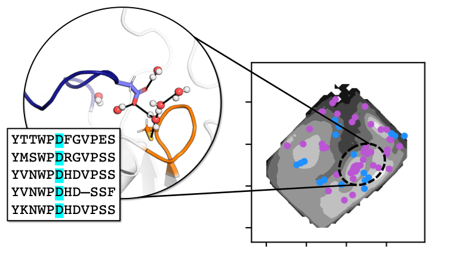

WatCon
==============================
[//]: # (Badges)

WatCon is a Python package which can be used to comprehensively analyze water networks in both static structures and dynamic trajectories.
WatCon further allows for analysis of conserved water positions and interactions across protein families and allows for conserved water netowrks to be shown easily via PyMOL projections. WatCon was first introduced in the publication "WatCon: A Python Tool for Analysis of Conserved Water Networks Across Protein Families".

Full documentation is available at https://watcon.readthedocs.io/en/latest/, which includes installation instructions, user information, and helpful tutorials.

### Copyright

Copyright (c) 2025, Alfie-Louise Brownless, Shina Caroline Lynn Kamerlin

### License and Disclaimer

This software is published under a GNU General Public License v3.0.

As this software was made in part by people employed by Georgia Tech University we must also clarify: “The software is provided “as is.” Neither the Georgia Institute of Technology nor any of its units or its employees, nor the software developers of WatCon or any other person affiliated with the creation, implementation, and upkeep of the software’s code base, knowledge base, and servers (collectively, the “Entities”) shall be held liable for your use of the platform or any data that you enter. The Entities do not warrant or make any representations of any kind or nature with respect to the System, and the Entities do not assume or have any responsibility or liability for any claims, damages, or losses resulting from your use of the platform. None of the Entities shall have any liability to you for use charges related to any device that you use to access the platform or use and receive the platform, including, without limitation, charges for Internet data packages and Personal Computers. THE ENTITIES DISCLAIM ALL WARRANTIES WITH REGARD TO THE SERVICE,INCLUDING WARRANTIES OF MERCHANTABILITY, NON-INFRINGEMENT, AND FITNESS FOR A PARTICULAR PURPOSE TO THE FULLEST EXTENT ALLOWED BY LAW.”

#### Acknowledgements
 
Project based on the 
[Computational Molecular Science Python Cookiecutter](https://github.com/molssi/cookiecutter-cms) version 1.10.

### Citing this Work

If you find this software useful in your work, please cite the following manuscript:

XXX

