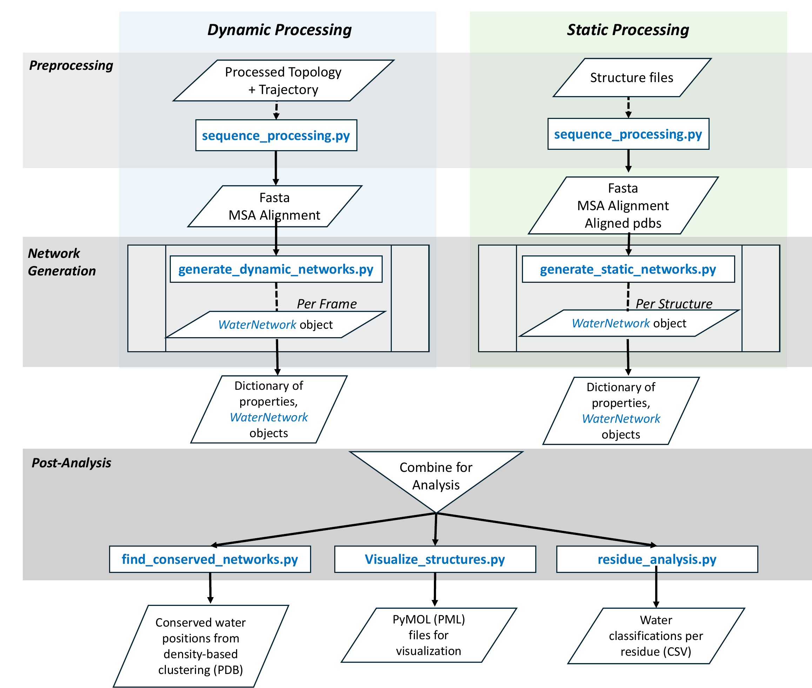

WatCon Package
==============

WatCon is organized in the following manner:

   Image sourced from DOI: 10.1021/jacsau.5c00447 

Details on the contents of WatCon are outlined below.

Subpackages
-----------

.. toctree::
   :maxdepth: 4

   WatCon.tests

Submodules
----------

.. toctree::
   :maxdepth: 2

   source/modules/WatCon
   source/modules/WatCon.sequence_processing
   source/modules/WatCon.generate_dynamic_networks
   source/modules/WatCon.generate_static_networks
   source/modules/WatCon.find_conserved_networks
   source/modules/WatCon.residue_analysis
   source/modules/WatCon.visualize_structures
