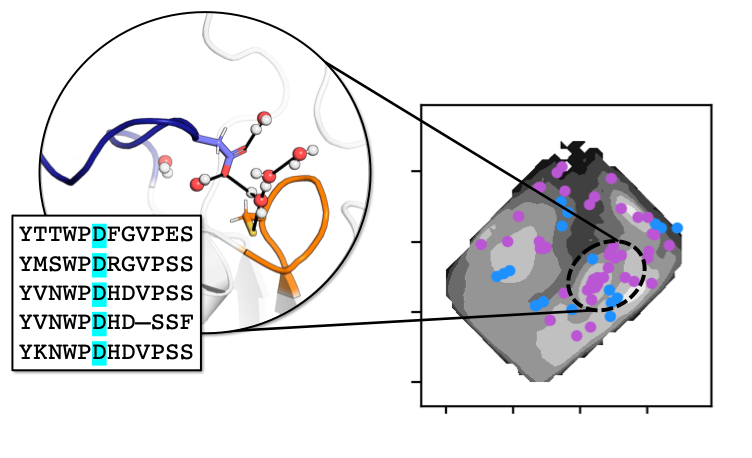

.. WatCon documentation master file, created by
   sphinx-quickstart on Thu Mar 15 13:55:56 2018.
   You can adapt this file completely to your liking, but it should at least
   contain the root `toctree` directive.

Welcome to WatCon's documentation!
=========================================================

WatCon is a Python package which can be used to comprehensively analyze water networks in both static structures and dynamic trajectories.
WatCon further allows for analysis of conserved water positions and interactions across protein families and allows for conserved water netowrks to be shown easily via PyMOL projections.

.. grid:: 1 1 2 2

    .. grid-item-card:: Getting Started
      :margin: 0 3 0 0
      
      Learn the basics of using WatCon.

      .. image:: images/onewater.png
         :width: 120
         :align: center

      .. button-link:: ./getting_started.html
         :color: primary
         :outline:
         :expand:

         To the Getting Started Guide

      

    .. grid-item-card::  User Guide
      :margin: 0 3 0 0
      
      An in-depth guide for users.

      .. image:: images/twowater.png
         :width: 120
         :align: center
         
      .. button-link:: ./user_guide.html
         :color: primary
         :outline:
         :expand:

         To the User Guide
      
      

    .. grid-item-card:: API Reference
      :margin: 0 3 0 0
      
      How to use the API of WatCon.

      .. image:: images/threewater.png
         :width: 120
         :align: center
   
      .. button-link:: ./api.html
         :color: primary
         :outline:
         :expand:

         To the API Reference.

      

    .. grid-item-card::  Tutorials
      :margin: 0 3 0 0
      
      Example tutorials for WatCon.

      .. image:: images/fourwater.png
         :width: 120
         :align: center

      .. button-link:: ./tutorials.html
         :color: primary
         :outline:
         :expand:

         To the Tutorials

.. toctree::
   :maxdepth: 2
   :hidden:
   :titlesonly:

   getting_started
   user_guide
   tutorials
   api
   installation
