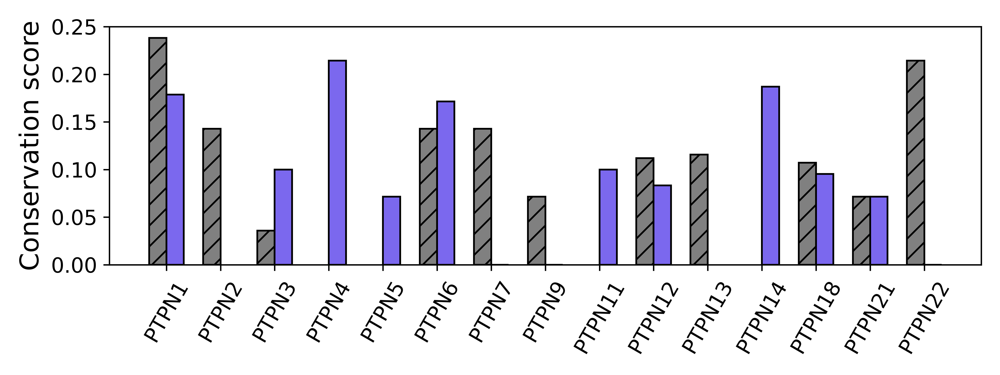
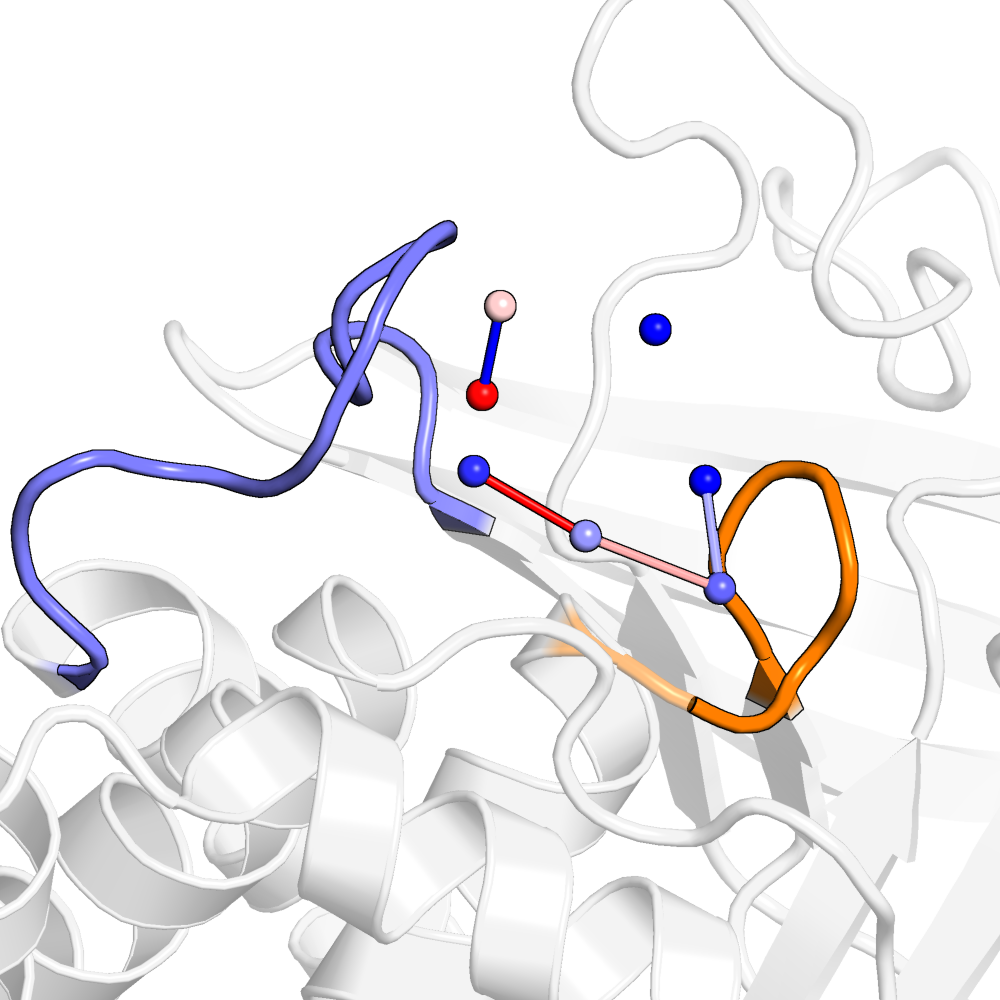

Family Analysis
===============

.. role:: python(code)
   :language: python

Generally, one may wish to use WatCon to study water network structure across a family of protein. In the previous tutorials, we studied the protein tyrosine phosphatase (PTP) PTP1B. We will now expand our analysis to include all non-receptor classical PTPs. Since PTP1B is much more well-studied than many of these other PTPs, there are a plethora of crystal structures available for that structure and generally quite few crystal structures available for the other PTPs. As a result, we will compare the water networks of all of our PTPs to the clustered water networks calculated in the :doc:`prior tutorial <static_vs_dynamic>` of the WPD-loop closed conformation of PTP1B.

1. Preparing Structure Files
----------------------------

When choosing crystal structures for selection, we selected the highest resolution structure in the WPD-loop open and closed conformation for each gene of interest. This was done in order to ensure that results were not biased from having, say 100, structures of PTP1B (PTPN1) and only 2 structures of PTPN5. For each structure, we will keep a consistent naming scheme, that being :python:`${PDB_ID}_${gene}_${WPD-loop_conformation}.pdb` We will use the same procedure for structure setup as the :doc:`previous tutorial <static_vs_dynamic>`, and so will omit further details in this section for clarity.

2. Creating Input Files
-----------------------

We will use the same input files as from the previous tutorial, but will note any changes in reference residue indexing. That being, we will adjust the :python:`active_region_definition` and :python:`water_reference_resids` as needed to fit the residue indexing of a different structure. Regardless, we will use the same active region definition and hydrogen-bond cutoffs as the previous tutorial. Importantly, we will be combining WatCon results from the previous tutorial with these results to be able to compare the water networks of each PTP to the PTP1B WPD-loop closed structures analyzed in the previous tutorial.

3. Analysis
-----------

Calculating Conservation Scores
^^^^^^^^^^^^^^^^^^^^^^^^^^^^^^^

We will leverage WatCon's ability to compare networks across structures to compare the networks among each structure with the PTP1B closed WPD-loop summary clusters. Generally, WatCon has a built in method for plotting commonality that can be called by specifying the following lines in an analysis input file:

.. code-block:: txt

   cluster_filebase: STATIC_CLOSED    ; Name of pdb file containing clusters to compare to
   calculate_commonality: hist        ; Produce commonality plot either as a 'bar' bar graph or 'hist' histogram

You have the option of creating a histogram of conservation scores or a bar plot which showcases conservation scores per structure. We note that using the analysis input file in this way, although generally convenient, will not work in our case since we want to calculate commonality to the set of PTP1B closed structures, which were aligned to a different set of coordinates. Additionally, for our particular case, it would benefit us to color bars differently dependent on whether the structure has a WPD-loop closed or open conformation. However, we can use the python API to transform the coordinates of the clusters to calculate commonality. 

.. code-block:: python
   
   import pickle
   from WatCon import sequence_processing, find_conserved_networks

   #Load WatCon data for combined PTPs
   with open('watcon_output/STATIC.pkl', 'rb') as FILE:
      e = pickle.load(FILE)
   networks = e[1] 
   names = e[3]

   #Load coordinates from cluster pdb
   cluster_coordinates = find_conserved_networks.get_coordinates_from_pdb('CLUSTERS_PTP1B_CLOSED.pdb')

   pdbs = ['2F71_PTPN1_closed_aligned.pdb', '1AAX_aligned.pdb'] #One PDB from current dataset and the other from the previous PTP1B closed dataset.

   #Get alignment information to move coordinates of clusters
   rotation_information = sequence_processing.perform_structure_alignment(pdbs, out_dir='aligned_pdbs', sort_pdbs=False)

   #Transform cluster coordinates
   transformed_centers = np.dot(cluster_coordinates, rotation_information['Rot'][0].T) + rotation_information['Trans'][0]

   #Calculate commonality to transformed centers
   commonality_dict = find_conserved_netowrks.find_commonality(networks, transformed_centers, names, dist_cutoff=1.0)

Let's first create a bar plot which shows the commonality score for each PTP. To create a bar plot for each PDB we can use the built in function from WatCon:

.. code-block:: python

   from WatCon import find_conserved_networks

   find_conserved_networks.plot_commonality(files=None, input_directory=None, cluster_pdb=None, commonality_dict=commonality_dict, plot_type='bar', output='commonality')

However, for our purposes, it would benefit us to show the differences between closed and open structures more clearly. As a result, we will provide a more complex plotting script:

.. code-block:: python

   #Initialize figure
   fig, ax = plt.subplots(1, figsize=(8,3), tight_layout=True)

   #Establish order to present
   desired_order = ['PTPN1','PTPN2','PTPN3','PTPN4','PTPN5','PTPN6','PTPN7','PTPN8','PTPN9','PTPN11','PTPN12','PTPN13','PTPN14','PTPN18','PTPN21','PTPN22']

   # Collect data for plotting
   gene_data = {}
   for i, (name, commonality) in enumerate(commonality_dict.items()):
       gene = name.split('_')[1]
       structure = name.split('_')[2]
   
       if gene not in gene_data:
           gene_data[gene] = {'open': None, 'closed': None}
   
       #Identify whether structure is open or closed
       if structure == 'open':
           gene_data[gene]['open'] = commonality
       elif structure == 'closed':
           gene_data[gene]['closed'] = commonality
   
   # Make x-ticks
   genes = list(gene_data.keys())
   ordered_genes = [gene for gene in desired_order if gene in gene_data]
   x = np.arange(len(ordered_genes))
   width = 0.32
   
   #Plot bars    
   for i, gene in enumerate(ordered_genes):
       open_score = gene_data[gene]['open']
       closed_score = gene_data[gene]['closed']
   
       if closed_score is not None:
           ax.bar(x[i] - width/2, closed_score, width, color='gray', hatch='//', edgecolor='k', label=f'{gene} open' if f'{gene} open' not in ax.get_legend_handles_labels()[1] else '')
       if open_score is not None:
           ax.bar(x[i] + width/2, open_score, width, color='mediumslateblue', edgecolor='k', label=f'{gene} closed' if f'{gene} closed' not in ax.get_legend_handles_labels()[1] else '')
       
   ax.set_xticks(x)
   ax.set_xticklabels(ordered_genes, fontsize=12)
   ax.set_ylabel('Conservation score', fontsize=15)
   ax.tick_params(axis='y', labelsize=12)
   ax.tick_params(axis='x', rotation=60)
   plt.savefig('conservation_histogram.png', dpi=200)

Here we color open structures by open purple bars and closed structures with gray cross-hatched bars. From this image we can tell that PTPN1 (PTP1B) in both the open and closed state show very high conservation to the PTP1B closed network, which makes logical sense. We can see that PTPN22 closed also has a high conservation score, and interesting, so does PTPN4 and PTPN14 in the open state. Further examination on which water locations are most conserved could give us better indication as to how sequence related to network conservation in PTPs.

Projecting Conservation of Water Positions and Interactions
^^^^^^^^^^^^^^^^^^^^^^^^^^^^^^^^^^^^^^^^^^^^^^^^^^^^^^^^^^^

Although determining overall conservation scores are useful for understanding broadly how water positions in different structures are conserved, it can often be more useful to understand which water molecules are most highly conserved. This idea can be addressed easily using WatCon. If focusing on clusters already aligned to the current set of structures, analysis input files can be used, adding the following lines:

.. code-block:: txt

   cluster_filebase: STATIC_CLOSED  ; Name of pdb file containing clusters to compare to
   color_by_conservation: 'all'     ; Produce .pml file coloring either 'centers', 'connections' or 'all' by conservation

Since we have already transformed our cluster coordinates directly, we instead will once again use the python API directly. Note we are using the same :python:`netowrks` and :python:`transformed_centers` that we defined earlier on in the tutorial.

.. code-block:: python
   
   from WatCon import find_conserved_networks

   center_dict = find_conserved_networks.identify_conserved_water_clusters(networks, transformed_centers, dist_cutoff=1.0, filename_base='PTPs_compare_PTP1B')
   interaction_dict_clustering = find_conserved_networks.identify_conserved_water_interations_clustering(networks, transformed_centeres, max_connection_distance=4.5, dist_cutoff=1.0, filename_base='PTPs_compare_PTP1B')

This will write a new PDB of the same cluster centers as before (although now aligned to our current working coordinate frame) with the b-factor column labeled by a normalized conservation score. In this case, for each structure, we find how many waters are within 1 Angstrom of a cluster center and use a min-max scaling to normalize the final value. Then, we created a .pml file which will color pairwise 'interactions' among clusters by conservation; these are not really interactions since the clusters are only approximate locations of conserved water molecules. Rather, the conservation of these 'interactions' indicates how often two waters are present simultaneously, which provides a good indication as to how certain aspects of water networks are conserved across structures at a coarse level. Using PyMOL, we can then visualize both how conserved each cluster center is and how conserved the pairwise clusters are:

Here, conservation is colored as a spectrum from blue-to-red, with red being more conserved and blue being less conserved. We can see that there are fleeting water positions around the WPD-loop (blue) which are not highly conserved. This makes sense as our static structures contain a variety of different WPD-loop conformations, and so the neighboring waters will likely be in very different positions across structures. However, the N-terminal portion of the WPD-loop contains highly conserved water positions, which do not interact directly with waters deeper into the active site. Furthermore, there are clusters of water molecules closer to the P-loop (orange) which are not highly conserved across structures. This is likely due to the fact that many closed crystal structures contain ligands or bound ions, preventing water molecules within these regions.

.. note:: Make sure to load the outputted .pml file after loading in the cluster PDB, but **before** loading in any other structure files.
