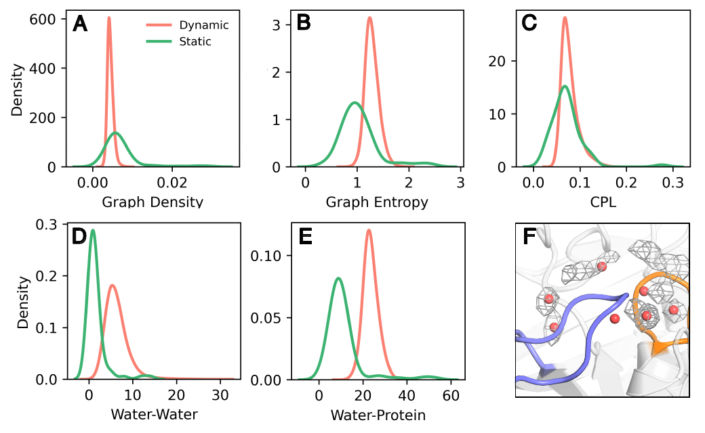
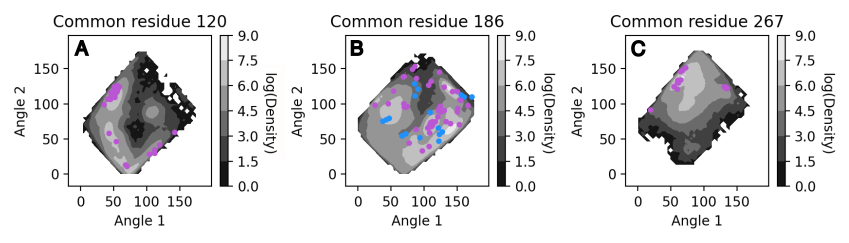

Comparing Static and Dynamic Information
========================================

.. role:: python(code)
   :language: python
   

WatCon can be used to combine information derived from both static and dynamic structure data. Here we provide a brief tutorial indicating how to process these types of data differently for subsequent combination. We will continue our investigation of the PTP1B protein tyrosine phosphatase by combining WatCon analysis conducted on closed WPD-loop dynamic trajectories and closed WPD-loop crystal structures. Since we wish to have a common indexing scheme for both our dynamic and static structures, we need to adjust our dynamic input files from the last tutorial to take this into account. 

1. Preparing Structure Files
----------------------------

We will prep our static structure files in the same manner as outlined in the :docs:`Basic Tutorial <basic_tutorial>` tutorial. Our dynamic trajectories will be prepped in the same way as discussed in the :docs:`Trajectory Analysis <trajectory_analysis>` tutorial, but we need to take a slight step further. Since we want to ensure that our dynamic structures can be analyzed along with our static structures, we need to include a starting structure from our trajectories into the sequence alignment. This can be done easily, but does require a PDB file. We can create a PDB file from any MDAnalysis-readable topology file in the following manner:

.. code-block:: python
   
   import MDAnalysis as mda
   
   u = mda.Universe('path/to/topology/file')
   ag = u.select_atoms('all')

   ag.write('path/to/pdb/file.pdb')

WatCon can then be used to create a fasta file from this PDB (if one does not exist already). Then, the same MSA alignment process should be conducted as described in the :docs:`Basic Tutorial <basic_tutorial>` but including the new PDB and fasta file from the dynamic structures.

2. Creating Input Files
-----------------------

We will use effectively the same input files for our trajectories as shown in the :docs:`Trajectory Analysis <trajectory_analyisis>` tutorial, with the addition of this section:

.. code-block:: txt

   ; WatCon PTP1B_closed_1 Input File 

   ... ; Same content as previous tutorial

   ; MSA Indexing
   msa_indexing: on                                ; Utilize/perform an MSA
   alignment_file: alignment.txt                   ; Name of alignment file (if file does not exist,
                                                   ;     Modeller will be used to write this file)
   combined_fasta: all_fastas.fa                   ; Name of combined fasta file
   fasta_directory: fasta                          ; Directory containing individual fasta files
   MSA_reference_pdb: PTP1B_Closed_1.pdb           ; PDB associated with trajectory structures
   
   ; Classify waters from MSA
   classify_water: on                              ; Classify water by angles and MSA
   water_reference_resids: 70,#153                 ; Residue positions to use as reference points
                                                   ;     (in relation to MSA_reference_pdb)
   classification_file_base: DYNAMIC_Closed_1      ; Classification file basename

.. note:: The :python:`MSA_reference_pdb` file can be in any conformation, but needs to have residue numbering accurate to the inputted trajectories. 

Since we will be comparing static and dynamic information for PTP1B in the closed WPD-loop state, we will only conduct a WatCon analysis on the closed WPD-loop starting structure trajectories.

For our static structures, we will use the following input file:

.. code-block:: txt

   ; WatCon Sample Input File
   
   ; Initialization
   structure_type: static                          ; Create static networks
   structure_directory: aligned_with_waters        ; Directory of structure files
   network_type: water-protein                     ; Create water-protein network
   include_hydrogens: off                          ; No hydrogens present in crystal structures
   water_name: default                             ; No custom water names
   max_distance: 3.7                               ; Max distance between donor-acceptor for HBond
   
   ; Property calculation
   density: on
   connected_components: on
   interaction_counts: on
   per_residue_interactions: on
   characteristic_path_length: on
   graph_entropy: on
   clustering_coefficient: on
   save_coordinates: on
   shortest_path: on
   analysis_selection: all                         ; Selection for analysis
   
   ; Active site definition
   active_region_reference: resid#220#or#resid#214 ; MDAnalysis selection language to center active site
   active_region_COM: on                           ; Use center of mass of active region selection
   active_region_only: on                          ; Indicate whether to only calculate water networks
                                                   ;     around an active site
   active_region_radius: 9                         ; Radius of active site around reference
   
   ; Visualization
   project_networks: on                            ; Create PyMOL files per pdb/frame
   
   ; Clustering
   cluster_coordinates: on                         ; Perform a clustering analysis on all coordinates
   clustering_method: hdbscan                      ; Clustering algorithm: dbscan, hdbscan, or optics
   min_cluster_samples: 5                          ; Minimum samples per cluster
   eps: 0.0                                        ; Eps value for clustering
   
   ; MSA Indexing
   msa_indexing: on                                ; Utilize/perform an MSA
   alignment_file: alignment.txt                   ; Name of alignment file (if file does not exist,
                                                   ;     Modeller will be used to write this file)
   combined_fasta: all_fastas.fa                   ; Name of combined fasta file
   fasta_directory: fasta                          ; Directory containing individual fasta files
   MSA_reference_pdb: 1AAX_aligned.pdb             ; Any pdb which can be used as a reference
                                                   ;     (active_region_reference needs to be accurate
                                                   ;     for this structure)
   
   ; Classify waters from MSA
   classify_water: on                              ; Classify water by angles and MSA
   water_reference_resids: 70,#153                 ; Residue positions to use as reference points
                                                   ;     (in relation to MSA_reference_pdb)
   classification_file_base: STATIC                ; Classification file basename
   
   ; Miscellaneous
   num_workers: 10                                  ; Number of cores available for parallelization

3. Run WatCon
-------------

Once again, we can call WatCon on the command line, and will need to run it separately for our static and dynamic data.

.. code-block:: console
   
   $ python -m WatCon.WatCon --input input_dynamic.txt --name PTP1B_Dynamic_Closed_1
   $ ... (repeat for other trajectory replicas)
   $ python -m WatCon.WatCon --input input_static.txt --nmae PTP1B_Static_Closed

After running the static and dynamic analysis, there will be nine files in the **watcon_output** folder, eight corresponding to each trajectory and one corresponding to the static structures which will then be used for the next section. There will also be a PDB file saved which contains dummy water atoms at the positions of the clustered water coordinates for the static structures. To compare water density hotspots for trajectories, we need to calculate density histograms (more details on these choices in XXX), which can be done using the WatCon python API. 

.. code-block:: python
   
   from WatCon import generate_dynamic_networks

   generate_dynamic_networks.collect_densities('path/to/topology/file', 'path/to/concatenated/trajectory/file',active_region_definition='resid 220 or resid 215',active_region_COM=True, custom_selection='', water_name='WAT', water_oxygen='O', 'PTP1B_Closed_Densities')

This function will write both a .dx file containing the calculated water densities and a PDB file with dummy water atoms positioned at the minima of the density histograms.

.. note:: When using the :mod:`WatCon.generate_dynamic_networks.collect_densities` function, we recommend using **one concatenated trajectory**. PBC conditions should be fixed, but all frames need not be aligned to each other as they will be aligned within the function. After running, a temporary trajectory file "tmp.dcd" will be written. We recommend visualizing this trajectory to ensure that proper alignment has occurred. If so, this file may be safely deleted.

4. Analysis
-----------

Distribution of Metrics
^^^^^^^^^^^^^^^^^^^^^^^

Let's first begin by comparing the distrbutions of calculated metrics between the static and dynamic data. This can be done easily by using a WatCon analysis input file. Here is an example:

.. code-block:: txt

   ; Sample input file for WatCon analysis

   ; Initialize
   input_directory: watcon_output                                   ; Folder which contains outputted WatCon .pkl files
   concatenate: PTP1B_Dynamic_Closed_1, PTP1B_Dynamic_Closed_2, ... ; Concatenate all trajectory files   
   
   ; Basic metric analysis
   histogram_metrics: on                         ; Will make basic matplotlib histograms of metrics according to desired concatenation

This will produce a series of histograms comparing the static and dynamic information, similar to this figure.

As we can see, the number of water-water and water-protein interactions is consistently higher for the dynamic information versus the static. This makes logical sense since the dynamic structures have far more waters present and so far more opportunities for water-protein interactions. The graph entropy is also consistently slightly higher for the dynamic structures versus the static structures. The density, interestingly, is not higher for the dynamic networks despite greater numbers of waters present. This is likely because although the static structures have fewer waters present, the ones that are resolved are more tightly bound to the protein and thus are more likely to have strong interactions.

Clustered Waters
^^^^^^^^^^^^^^^^

Although we observe differences in network structure between the dynamic and static data, we should also consider differences in the locations of the water hotspots. In order to do this, we will compare the clustered coordinates from HDBSCAN clustering methods on all static structures with density histograms for the dynamic structures. Since the static and dynamic structures were run separately, however, they are not aligned and loading the density hotspots and cluster centers simultaneously will not produce meaningful results. A PDB file was produced when the density distributions were calculated which aligns with the density hotspots, and the cluster centers will align with the aligned static structure files. So, the two clusters can be aligned in the following manner using PyMOL:

.. code-block:: console

   $ load /path/to/density/pdb, density_pdb
   $ load /path/to/density/file.dx, density_spots
   $ isomesh mesh1, density_spots, level=1.5
   $ load aligned_with_waters/PDB_FILE, pdb
   #Copy mesh1 into density_pdb
   $ align density_pdb, pdb
   $ hide everything, density_pdb
   $ load /path/to/cluster/centers.pdb

When doing so, you should be able to compare the hotspots very easily:

.. image:: ../images/densities_clusters.png
   :width: 400
   :align: center

We can see that the MD data does sample most of the crystal structure hotspots, but not quite all. These results indicate that in order to completely understand the complex water networks of our proteins of interest, it may benefit us to combine MD and crystal structure data. Luckily, this process is made quite easy with the flexible use of WatCon!

Water-Protein Interactions
^^^^^^^^^^^^^^^^^^^^^^^^^^

Let's leverage the unique two-angle calculations to see how the distribution of residue-water interactions differs between the static and dynamic structures. Since we already ensured that angle classification files were written from our initial input file, plotting these results can be done easily by adding this line to the analysis input file.

.. code-block:: txt

   ; Residue-water classification
   classify_waters: on               ; Use outputted .csv files from 2-angle classification to generate scatter/density plots

You can also call the WatCon API directly to do this same thing:

.. code-block:: python

   from WatCon import residue_analysis
   import os

   input_dir = 'msa_classification' #Assuming the files are stored in the default 'msa_classification' directory

   csvs = [f for f in os.listdir(input_dir) if f.endswith('.csv')]    
   residue_analysis.plot_interactions_from_angles(csvs, input_dir, output_dir='MSA_images', name1='DYNAMIC', name2='STATIC')
 

This will produce one image for every conserved residue which exhibits water-protein interactions. The dynamic data will be used to generate an underlying surface distribution of angle calculations, while values associated from the static structures will be plotted on top as scatterpoints and colored blue (backbone atoms) or purple (side-chain atoms). 

.. note:: The :mod:`WatCon.residue_analysis.plot_interactions_from_angles` function relies on two distinct naming schemes to differentiate between which data to plot as a contour surface and which to plot as scatterpoints. The default is 'DYNAMIC' and 'STATIC', assuming files are named starting with either 'DYNAMIC' or 'STATIC'. This can be changed by altering the :python:`name1` or :python:`name2` key words, which is currently only possible through the use of the API. CSV filenames are defined by the :python:`classification_file_base` input.

As we can see, the distribution of water positions for the static structures is a subset of the total distribution sampled by the dynamic data. However, there can be regions of space that is not easily sampled by MD alone, and so crystal structure snapshots can provide a very useful indication of the probable extent of conformational space that can be sampled. In this way, it is valuable to combine static and dynamic information to gather a more comprehensive understanding of complex water network structure in proteins.

