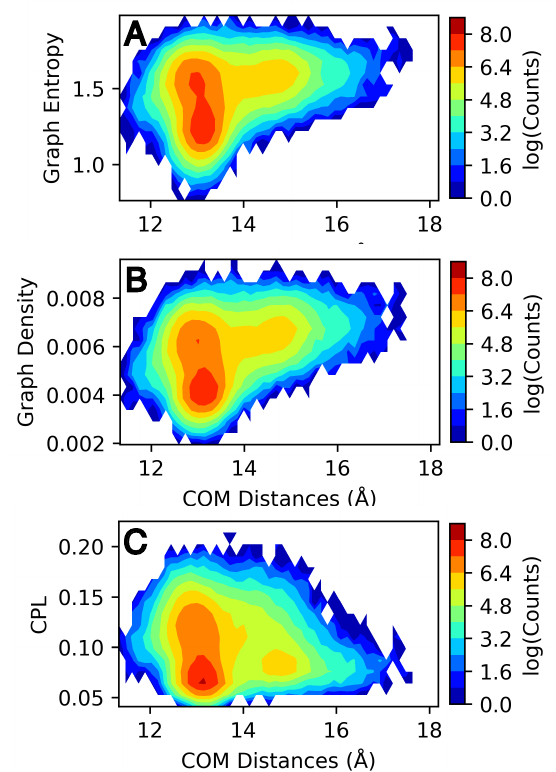
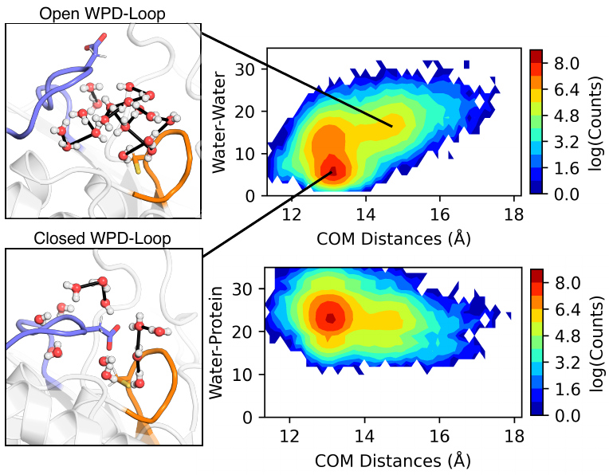
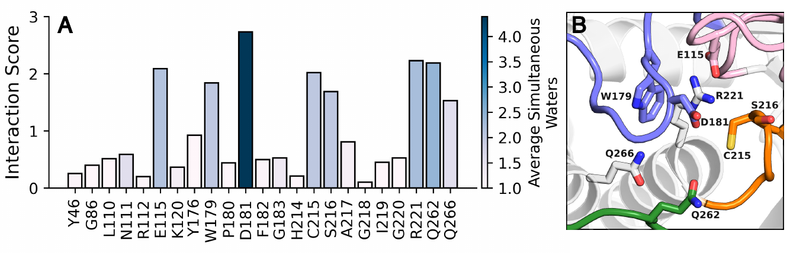

Trajectory Analysis
-------------------

.. role:: python(code)
   :language: python

We present how WatCon can be used in order to analyze water network structure and important water-protein interactions across a molecular dynamics trajectory. This example taken from (XXX) analyzes the protein tyrosine phosphatase (PTP) PTP1B. This protein notably contains a mobile active site loop, the WPD-loop, identified by the general acid D181. The movement of this loop plays a major role in the catalytic regulation of this enzyme and importantly the movement of this loop fundamentally changes the solvation of the active site. We will use WatCon to investigate the effects of this loop movement.

1. Prepare Structures and Trajectories
^^^^^^^^^^^^^^^^^^^^^^^^^^^^^^^^^^^^^^

We conducted 8 x 1.5μs trajectories of PTP1B initiated from the WPD-loop closed and WPD-loop open conformations. See (XXX) for more details on simulation setup. We processed our trajectories prior to this analysis, fixing periodic boundary condition (PBC) and aligning the protein within the box. Our structures contain the same atom-numbering regardless of configuration, and so we do not need to perform a multiple sequence alignment to ensure consistent residue numbering. Furthermore, since we have preprocessed our trajectories, we do not need to align structures, and so we can leave our topology in any MDAnalysis-readable format and skip further steps involving the :mod:`WatCon.sequence_processing` module.

2. Create Input Files
^^^^^^^^^^^^^^^^^^^^^

In our case, we have 8 separate replicas for each configuration that we are sampling to analyze. We could concatenate all trajectories (making sure to keep all frames aligned) prior to WatCon analysis, or we can run WatCon separately for each trajectory and combine results later. We demonstrate using this method, as it can be preferable due to increased parallelization across trajectories. We can use either input files or the python API directly to do this, but we recommend for large trajectories using input files as the WatCon data will be saved in .pkl files which can be reloaded later for faster analysis. Here is a sample input files for our analysis.

.. code-block:: txt

   ; Input file: Closed PTP1B Unliganded Run 1

   ; Initialization
   structure_type: dynamic                         ; Dynamic for trajectories
   structure_directory: closed_unliganded_ptp1b    ; Closed unliganded directory (contains topology and trajectory file)
   topology_file: WT_PTP1B_Apo_Closed.gro          ; Name of topology
   trajectory_file: run_1.xtc                      ; Name of trajectory
   network_type: water-protein                     ; Create networks with water and protein atoms
   include_hydrogens: on                           ; Create a directed graph including hydrogens
   water_name: default                             ; We don't have any custom water names, so default is fine
   multi_model_pdb: False                          ; We don't have PDB files with multiple models
   max_distance: 2.7                               ; Max distance between two atoms (H-O) to be considered
                                                   ;     in an HBond. We are using a generous cutoff due to 
                                                   ;     a deprotonated cysteine residue which can form very long
                                                   ;     H-Bonds.
   angle_criteria: 120                             ; Angle criteria for calculating HBonds
   
   ; Property calculation
   density: on
   connected_components: on
   interaction_counts: on
   per_residue_interactions: on
   characteristic_path_length: on
   graph_entropy: on
   clustering_coefficient: on
   save_coordinates: on
   shortest_path: on
   analysis_selection: all                         ; Selection for analysis

   ; Active site definition
   active_region_reference: resid#220#or#resid#214 ; We center our active region on the center of mass of 
                                                   ; R221 (R220 in this structure) and C215 (C214 in this structure)
   active_region_COM: on                           ; Use center of mass of the given selection
   
   active_region_only: on                          ; We will only use the active region selections to calculate our networks
   active_region_radius: 9                         ; Radius of active site around refernce
   
   ; Visualization
   project_networks: on                            ; Create PyMOL files per pdb/frame
   
   ; Clustering
   cluster_coordinates: off                        ; No clustering for this tutorial
   
   ; MSA Indexing
   msa_indexing: off                               ; No MSA for this tutorial
   
   ; Classify waters from MSA
   classify_water: off                             ; No two-angle classification for this tutorial
   
   ; Miscellaneous
   num_workers: 8                                  ; Use 8 cores to run calculations

Here we will point out some important choices that we have made for our system. 

   #. First, we point out that the catalytic cysteine involved in the generalized PTP mechanism is deprotonated in all PTPs. Since this deprotonated cysteine can form very important HBonds within our active site but has a larger VDW radius than other hydrogen-bond acceptors, we need to ensure that our HBond distance cutoff is sufficiently large to encompass those interactions. Naively increasing the distance cutoff for these bonds can have negative consequences, so in order to make sure that we don't accidentally include invalid interactions, we will first set the :python:`include_hydrogens=True` flag. This will then allow us to use angles to refine our HBonding definition. So to ensure that we include any HBonds involving the sulfur atom of the deprotonated cysteine, we set the (HBond acceptor)-H distance at 2.7Å (approximate donor-acceptor distance of 3.7Å) and the angle cutoff at 120°.  

   #. Next, since we are analyzing fully solvated protein boxes from trajectories, we need to define an :python:`active_region` both to save on computational analysis time and to ensure that we don't have an overwhelming amount of data to analyze. Generally, although you can run WatCon on the entire solvated box, we recommend to isolate only to a specific :python:`active_region` for large trajectories, and even run WatCon multiple times separately for different active regions if there are multiple regions of interest to analyze. This will immensely save on computational time. Here, we define our active region as 9Å around the center of mass of the R221 and C215 residues.

   #. Finally, we are setting :python:`project_networks=True` to be able to visualize each of the networks in PyMOL. However, if you have very long trajectories, you may want to set this flag to False and only turn on when you know that you want to take an image of a particular set of frames, as this will create a .pml file for every frame in your trajectory.

3. Run WatCon
^^^^^^^^^^^^^

This input file (as noted by the title) will run for the first replica for the WPD-loop closed configuration. For the remainder of the trajectories, we will simply change the topology and trajectory inputted files while leaving the rest of our input file the same. We can then run each step with the standard WatCon command: 

.. code-block:: console

   $ python -m WatCon.WatCon --input input_dynamic.txt --name PTP1B_Closed_1

.. note:: Make sure to change the :python:`--name` flag for each replica to avoid overwriting previous files.

4. Analyze Results
^^^^^^^^^^^^^^^^^^

Network Properties
""""""""""""""""""

Let's first take a look at the global properties of the water networks and see how they correspond to WPD-loop motion. Prior to this WatCon analysis, we had already calculated the distance between the center of mass of the P-loop and WPD-loop at each step in the trajectory using MDAnalysis. We can then load these distance values along with our calculated metrics from WatCon to produce a series of 2D histograms showcasing the relationship between the WPD-loop conformation and water network structure.

.. code-block:: python

   import matplotlib.pyplot as plt
   import numpy as np
   import os
   import pickle

   #Set directories containing distance files and WatCon files
   distance_dir = 'distances'
   watcon_dir = 'watcon_output'

   #Set of metrics to loop through
   metrics = ['density', 'characteristic_path_length', 'entropy']
   
   #Initialize final dictionary
   metric_dict = {'density':[],'characteristic_path_length':[], 'entropy':[], 'water-water':[], 'water-protein':[]}

   
   metrics_plot =  ['density', 'characteristic_path_length', 'entropy', 'water-water', 'water-protein']
   plotting_names = ['Graph Density', 'CPL', 'Graph Entropy', 'Water-Water', 'Water-Protein']

   #Create empty array to store distances
   distances_compil = []

   for i, structure in enumerate(['open', 'closed']):
        for run in [1,2,3,4,5,6,7,8]:
            distance_file = os.path.join(distance_dir, f"PTP1B_WT_PTP1B_Apo_{structure}_{run}.npy")   #Load file of distances
            distances = np.load(distance_file)

            #Append to total array of distances
            distances_compil.extend([f for f in distances])
    
            #Load watcon file
            watcon_file = f"watcon_output/PTP1B_{structure}_{run}.pkl"
    
            with open(watcon_file, 'rb') as FILE:
                e = pickle.load(FILE)
    
            #Loop through all frames
            for ts_dict in e[0]:
                for metric in metrics:
                    #Either append value or list of values
                    if isinstance(ts_dict[metric], float):
                        metric_dict[metric].append(ts_dict[metric])
                    else:
                        metric_dict[metric].extend([f for f in ts_dict[metric]])

   #Convert distances to numpy array
   distances = np.array(distances_compil)

   #Obtain water-water and water-protein interactions and add to dictionary
   for j, structure in enumerate(['open', 'closed']):
       for run in [1,2,3,4,5,6,7,8]:
           watcon_file = f'{watcon_dir}/PTP1B_{structure}_{run}.pkl'
   
           with open(watcon_file, 'rb') as FILE:
               e = pickle.load(FILE)
   
           for i, ts_dict in enumerate(e[0]):
              #water-water and water-protein contain more information, but just add interaction_counts
              metric_dict['water-water'].append(ts_dict['interaction_counts']['water-water'])
              metric_dict['water-protein'].append(ts_dict['interaction_counts']['water-protein'])

   #Finally, create 2D histograms
   for i, metric in enumerate(metrics_plot):
       
       #Initialize figure
       fig, ax = plt.subplots(1,figsize=(2.5,1.6))
       #Initialize colorbar and adjust axes
       cbar_ax = fig.add_axes([0.88,0.12,0.04,0.75])
       fig.subplots_adjust(left=0, right=0.85, wspace=0.1)

       #Get current metric
       metric_cur = np.array(metric_dict[metric])
   
       #Calculate histogram
       hist, xedges, yedges = np.histogram2d(distances.flatten(), metric_cur.flatten(), density=False, bins=[50,17]) #Adjust bin values as needed

       xcenters = (xedges[1:]+xedges[:-1])/2
       ycenters = (yedges[1:]+yedges[:-1])/2
  
       #Create contour plot 
       XX, YY = np.meshgrid(xcenters, ycenters)
       hist = np.log(hist.T)
       cm = ax.contourf(XX, YY, hist, levels=10, cmap='jet')
  
       #Create colorbars and labels 
       ax.set_xlabel('COM Distances (Å)')
       ax.set_ylabel(plotting_names[i])
       fig.colorbar(cm, cax=cbar_ax, label='log(Counts)')

       #Save figure
       fig.savefig(f"{metric}.png", dpi=200, bbox_inches='tight')
   

We see from these results that graph entropy and density increases subtly with WPD-loop opening, while characteristic path length decreases very subtly. Further details on these results and interpretations can be found in the source publication. More obviously, we can see that the number of water-water interactions increases as the WPD-loop opens. Using the :mod:`WatCon.visualize_structures` module, we can create pymol projections of these different conformations and visually see how the water-water and water-protein interactions change dependent on WPD-loop conformation.

We realize that this is a reasonably complex plotting script due to the fact that we wish to compare our computed metrics with previously gathered distance data. We note that if you want to plot only the 1D-histogram of metrics, this can be done easily by using the WatCon built-in post-analysis functionality. Here is an example input file that would accomplish this goal:

.. code-block:: txt

   ; WatCon post-analysis: PTP1B trajectories
   
   ; Intiialize
   input_directory: watcon_output                                                                    ; Folder containing WatCon .pkl files
   concatenate: PTP1B_closed_1, PTP1B_closed_2, PTP1B_closed_3, ..., PTP1B_open_1,...PTP1B_open_8    ; Files to concatenate (truncated for clarity, but you must list all files)

   ; Basic metric analysis
   histogram_metrics: on                                                                             ; Will make basic matplotlib histogram of metrics

Water-Residue Interactions
""""""""""""""""""""""""""

Now, let's look how our active region residues differentially interact with waters. We can access the :python:`per_residue_interaction` key of our metrics dictionary to produce an image which gives us an indication of both how often active region residues interact with waters and how many waters simultaneously interact with high-scoring residues. We can do this easily by specifying these options in a WatCon post-analysis file:

.. code-block:: txt

   ; WatCon post-analysis: PTP1B trajectories

   ; Initialize
   input_directory : watcon_output ; Folder containing WatCon .pkl files 
   
   ; Basic metric analysis
   residue_interactions : on       ; Create bar graphs of residue water interaction scores
   interaction_cutoff : 0.1        ; Cutoff for showing bars of interacting residues

Or this can be accomplished by using the python API directly:

.. code-block:: python 

   from WatCon import residue_analysis

   residue_analysis.plot_residue_interactions('path/to/topology/file', cutoff=0.1, watcon_directory='watcon_output', output_dir='images')

If we present the resulting bar plot with a projection of the high-scoring residues, we can obtain an image like this.

From this image, we see that residues E115, W179, D181, C215, S216, R221, Q262, and Q266 interact with far more waters consistently and simultaneously than other residues. As a result, modification of these residue positions likely would cause dramatic changes in water network structure. More extensive analysis can be conducted exploring more in-depth how specific network structure changes are correlated with differences in residue interactions and positions, which is now made easier with the development of WatCon.

